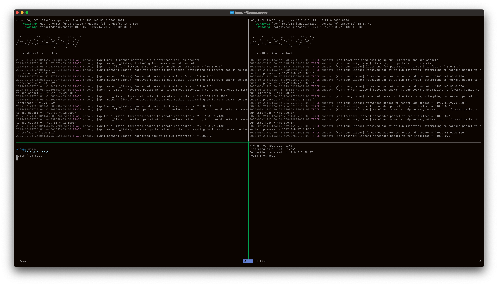

# Snoopy

A VPN written in Rust.

## Demo - `netcat` from a host to a container on a virtual network

#### Host

Physical IP: 192.168.97.0

Virtual Network IP: 10.0.0.2 (tun interface on host - macOS)

#### Container

Physical IP: 192.168.97.2

Virtual Network IP: 10.0.0.3 (tun interface on container - Linux)

