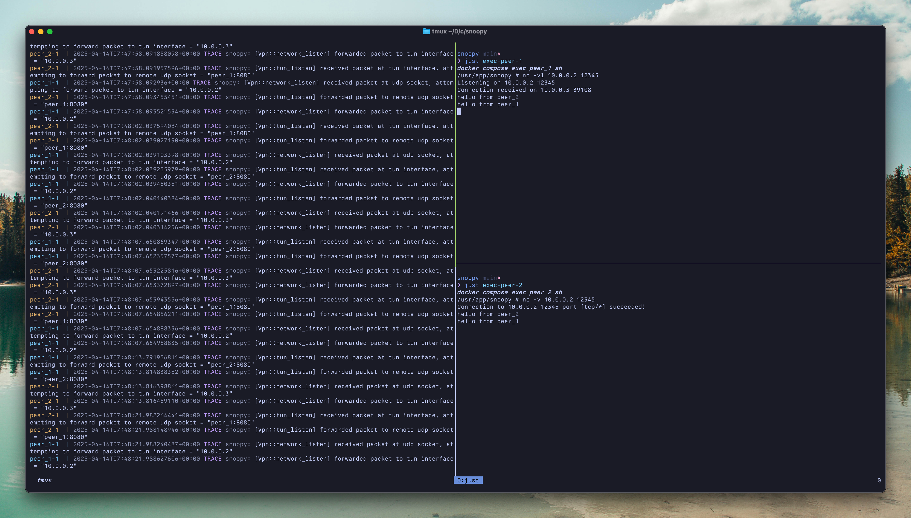

# Snoopy

A VPN written in Rust.

Inspired by [https://write.yiransheng.com/vpn](https://write.yiransheng.com/vpn)

---

## Demo - `netcat` between two containers

#### peer_1

Virtual Network IP: 10.0.0.2

#### peer_2

Virtual Network IP: 10.0.0.3



---

## Usage

1. Install `just` - [https://just.systems/man/en/](https://just.systems/man/en/)

2. Build the binary and image

```sh
just build-image
```

3. Start the peers

```sh
docker compose up
```

4. Exec into the containers from two different terminal sessions

```sh
just exec-peer-1 # peer-1

# another session
just exec-peer-2 # peer-2
```

5. Use the virtual addresses for communication

Example:

```sh
# peer_1
nc -vl 10.0.0.2 12345

# from peer_2
nc -v 10.0.0.2 12345
```

6. Stop the containers

```sh
docker compose down
```

---

## Credits

- [https://github.com/meh/rust-tun/](https://github.com/meh/rust-tun/)

---
