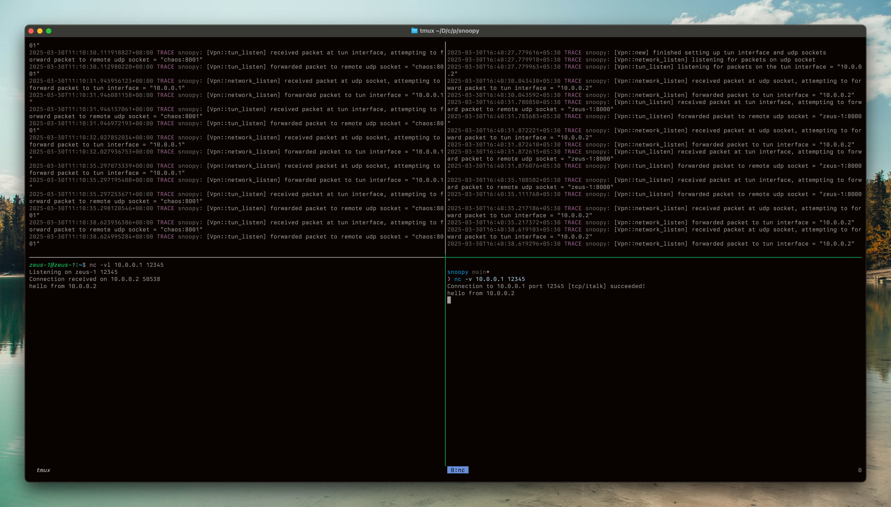

# Snoopy

A VPN written in Rust.

## Demo - `netcat` from a host to a VM over a virtual network

#### Host

Virtual Network IP: 10.0.0.2 (tun interface on host - macOS)

#### VM

Virtual Network IP: 10.0.0.1 (tun interface on VM - Linux)

## Credits

- [https://github.com/meh/rust-tun/](https://github.com/meh/rust-tun/)
